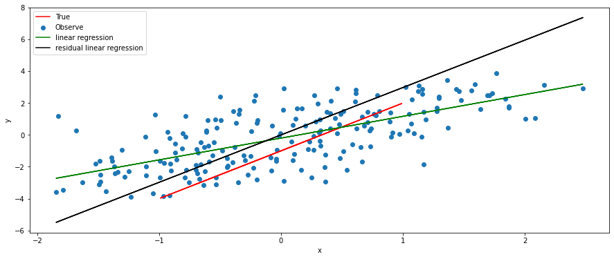
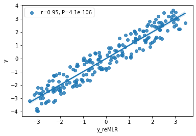

# An Introduction to rePLS


## Install 
```
pip install rePLS
```


## Usage 

<!-- The new ggseg-package version has introduced a new way of plotting the brain atlases, through a custom geom_brain (variant of geom_sf). This has introduced a lot of new functionality into the package, in addition to some new custom methods and objects. -->


```
from rePLS import rePLS, rePCR, reMLR

import numpy as np


n_samples, n_features, n_outcomes, n_confounders = 100, 10,5,2

n_components = 2

rng = np.random.RandomState(0)


Y = rng.randn(n_samples,n_outcomes)

X = rng.randn(n_samples, n_features)

Z = rng.randn(n_samples, n_confounders)


reg = rePLS(Z=Z,n_components=n_components)

reg.fit(X,Y)

Y_pred = reg.predict(X,Z)
```

## Example: Least squares and residual least squares 

```
import numpy as np
from rePLS import rePLS,reMLR
import matplotlib.pyplot as plt
from sklearn.linear_model import LinearRegression
rng = np.random.RandomState(0)


# generate x,y
N = 200
slope = 3
intercept = -1
x = np.random.uniform(-1,1,N)
y = x*slope + intercept
plt.plot(x,y,'r')


# x,y are affected by confounders
confounders = np.random.randn(*x.shape)*1.5
x = x + np.random.randn()*confounders
y = y + np.random.randn()*confounders + np.random.rand(*x.shape)*2
plt.scatter(x,y)


# using linear regression to find out relationship between x,y
x = np.expand_dims(x, axis=1)
lr = LinearRegression()
lr.fit(x,y)
y_pred = lr.predict(x)
plt.plot(x,y_pred,'g')
plt.legend(['True','Observe','OLS'])


# using residual linear regression
confounders = np.expand_dims(confounders, axis=1)
reg = reMLR(Z=confounders,n_components=0)
reg.fit(x,y)
y_plot_pred2 = x@reg.residual_model.coef_
y_pred2 = reg.predict(x,confounders) 
plt.plot(x,y_plot_pred2,'k')
plt.legend(['True','Observe','OLS','reMLR'])
```



**Compare correlation coefficient**

```
import pandas as pd
import seaborn as sns
import scipy.stats as stats

r, p = stats.pearsonr(y,y_pred)
df = pd.DataFrame({'y':y, 'y_LR':y_pred, 'y_reMLR':y_pred2})
sns.regplot(x="y_LR", y="y", data=df);
plt.legend([f'r={r:.2f}, P={p:1.1e}'])
```


```
r, p = stats.pearsonr(y,y_pred2)
sns.regplot(x="y_reMLR", y="y", data=df);
plt.legend([f'r={r:.2f}, P={p:1.1e}'])
```



## Example of rePLS for multivariate input (brain areas), multivariate output (disease scores)
[Simulation](https://share.streamlit.io/thanhvd18/re-pls-visualization/main/main.py)